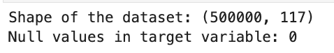
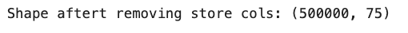
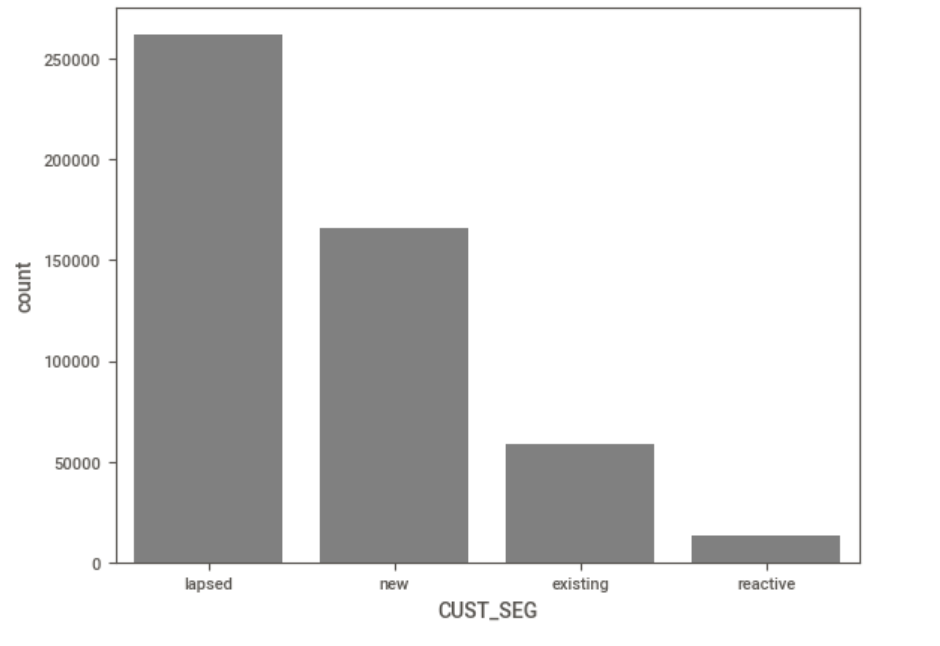
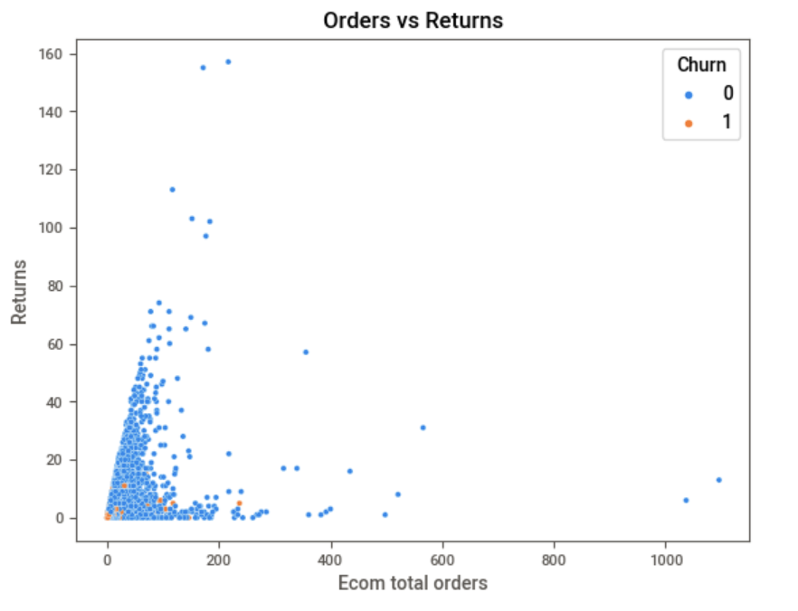
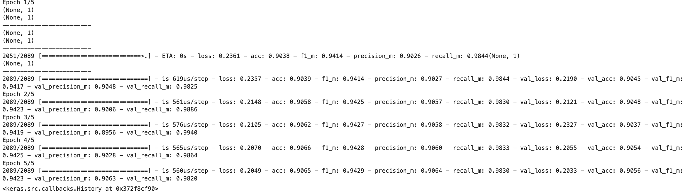
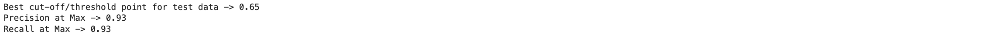

# **Machine Learning Project IA651 - Customer Churn Prediction**
##### Author: Rakesh Kantharaju, Nisar Killedar


### Problem Statement

With the aid of avaialable features, our aim is to predict whether our e-commerce customers will continue their relationship with the company or choose to churn in the upcoming year. 

### Dataset Description

We have a comprehensive dataset containing information on customers who have engaged with a fashion retail company, which operates both online (e-commerce) and physical stores. The dataset encompasses details such as orders, sales, returns, cancellations, customer activity on the website, and location information.

Within our dataset, we have a total of 114 features collected for the time frame of last one and half year.
Let me take you through some of the significant notations.

AMPERITY_ID - Customer ID

ECOM - Online (Digital) business

Store - Physical store business 

Cancelled - Orders or products cancellation

Returned - Products returned 

Gross Sales - Total revenue generated before deductions for discounts, returns.

Net Sales - Total revenue generated after deductions for discounts, returns.

AOV - Average Order Value ( $Total Revenue/Number of Orders$ )

AUR - Average Unit Revenue  ( $Total Revenue/Total Units Sold$ )

UPT - Units Per Transaction ( $Total Units Sold/Number Of Transactios$ )

Cust Type :
    
    - ECOM_ONLY : Customer who has shopped only online
    - STORE_ONLY : Customer who shopped only at Stores
    - OMNI - Customer who shopped at both Stores and online

Recency - How recent a customer has shopped represented in days.

Cust_Seg :

    - new : A customer who has a transaction in last 12 months and did no shop with us anytime before.
    - existing : A customer who has shopped with us last year as well as this year (last 12 months)
    - Reactive : Customer who has shopped long before and re-activated in this year. 
    - lapsed : An exiting Customer who has not shopped in last 12 months.
    
    

Clickstream data: 

        - Session: Visit by a customer 
        - Cart Additions: shows the number of times a visitor added something to their cart
        - Checkout:shows the number of times a visitor has checked out on the site

Is_Loyal_Customer - Weather customers are shopping with us rather with our compititors


### Usecase of this prediction ?

- **Customer retention** :
    Predicting churn enables proactive retention strategies, saving costs and preserving valuable clientele for the company.
- **Personalized Marketing**: 
    Anticipating churn informs tailored marketing initiatives, offering incentives to retain customers effectively for the company.
- **Customer Lifetime Value**: 
    Identifying churn risks aids in prioritizing retention efforts on high-value customers, enhancing Saks' long-term revenue and profitability.
- **Resource Allocation**: 
    Proactive retention efforts allocate resources efficiently, focusing on preserving customers most likely to churn, optimizing Saks' effectiveness.
- **Competitive Advantage**: 
    Predicting churn fosters customer loyalty and market share growth, furnishing Saks with a strategic edge in the competitive fashion retail landscape.

### Process Overview 

In our 5 years of experience in Retail domain and in analytics domain we have honed expertise in leveraging data to optimize strategies and drive business growth.
Out of all the projects, building models trying to predict customer behaviour was a very challenging task.As and when we get hold of new data on customers we were able to improve on our predictions which inturn reduced the churn rates and maximized customer LTV (lifetime value).


### Data Cleaning

 *To work on this project, you'll need additional packages such as tensorflow_addons, which might have an impact on other dependencies. To ensure a smooth installation process and to avoid conflicts with existing dependencies, I recommend creating a virtual Anaconda environment on your system.*


 Import the required packages 

 ```python
import pandas as pd, numpy as np
from timeit import default_timer as timer
from datetime import timedelta
import warnings
warnings.filterwarnings('ignore')
import pickle as pkl

from sklearn.metrics import accuracy_score
from sklearn.model_selection import train_test_split
from keras.models import Sequential
from keras.layers import Dense, Input, Flatten, BatchNormalization,Normalization
from tensorflow.python.keras.layers.recurrent import LSTM
from keras.optimizers import SGD
from keras.metrics import binary_accuracy
from keras.utils import to_categorical
from sklearn.preprocessing import MinMaxScaler
from keras.optimizers import Adam
from keras.models import Model
# from keras.utils.vis_utils import plot_model
import tensorflow as tf
from keras import metrics
import pickle as pkl
import tensorflow.keras.backend as K
import zipcodes
from operator import itemgetter
from tensorflow_addons.metrics import F1Score
from itertools import chain
from sklearn.metrics import ConfusionMatrixDisplay, confusion_matrix
import matplotlib.pyplot as plt
from sklearn import metrics
from sklearn.metrics import precision_score, recall_score
from sklearn.metrics import precision_recall_curve
pd.set_option('display.max_rows', None)
import seaborn as sns
```

#### Describe dataset

```python
ecom_df = pd.read_csv('sample_data.csv')
ecom_df=ecom_df.drop('Unnamed: 0',axis=1)
ecom_df.head(3)
```


Here, our target varibale is **'CHURNED'** therefore will remove rows whose 'churned' column has null values.

How do we define Churn ?

Customers who has not shopped with us for the past 12 months are labelled as Churned.

```python
print("Shape of the dataset:",ecom_df.shape)
ecom_df = ecom_df[~ecom_df['CHURNED'].isnull()]
print("Null values in target variable:",ecom_df['CHURNED'].isnull().sum())
```



#### Handle datatypes for our X variables

Check for object datatypes and convert them to numeric

```python
ex_col = ['AMPERITY_ID','FIRST_ORDERED_DATE','LAST_ORDERED_DATE','ECOM_FIRST_ORDERED_DATE',
          'ECOM_LAST_ORDERED_DATE','STORE_FIRST_ORDERED_DATE','STORE_LAST_ORDERED_DATE','CUST_TYPE',
          'CHURNED','CUST_SEG','SS_EMAIL','POSTAL','LOYALTY_FIRST_DATE'
         ]
in_col = list(filter(lambda x: x not in ex_col, ecom_df.columns))

cols_to_convert = ecom_df[in_col].select_dtypes(include='object').columns
ecom_df[cols_to_convert] = ecom_df[cols_to_convert].apply(pd.to_numeric, errors='coerce', downcast = 'float')
for i in in_col:
    print(i,":",ecom_df[i].dtype)
ecom_df.shape
```


As we focus on predicting the churn likelihood of our e-commerce customers, our prediction model we omit store data from consideration.

```python
col_l = ['FIRST_ORDERED_DATE','LAST_ORDERED_DATE','ECOM_FIRST_ORDERED_DATE',
        'ECOM_LAST_ORDERED_DATE','STORE_FIRST_ORDERED_DATE','STORE_LAST_ORDERED_DATE','LOYALTY_FIRST_DATE',
        'Unnamed: 0', 'SS_EMAIL', 'CUST_TYPE',
        'TOTAL_ORDERS',
        'STORE_TOTAL_ORDERS',
        'RETURNED_ORDERS',
        'STORE_RETURNED_ORDERS',
        'GROSS_ORDERED_QUANTITY',
        'STORE_GROSS_ORDERED_QUANTITY',
        'GROSS_SALES',
        'STORE_GROSS_SALES',
        'NET_SALES',
        'STORE_NET_SALES',
        'TOTAL_RETURNED_QUANTITY',
        'STORE_RETURNED_QUANTITY',
        'GROSS_DISCOUNT',
        'STORE_GROSS_DISCOUNT',
        'AOV',
        'STORE_AOV',
        'AUR',
        'STORE_AUR',
        'UPT',
        'STORE_UPT',
        'RECENCY',
        'GROSS_SALES_3M',
        'GROSS_SALES_6M',
        'GROSS_SALES_9M',
        'GROSS_SALES_12M',
        'GROSS_SALES_15M',
        'GROSS_SALES_18M',
        'ORDERS_3M',
        'ORDERS_6M',
        'ORDERS_9M',
        'ORDERS_12M',
        'ORDERS_15M',
        'ORDERS_18M'
        ]

df1 = ecom_df[ecom_df.columns[~ecom_df.columns.isin(col_l)]]
df1.shape
```



Postal code is a very important feature for our prediction, but we do have to clean the data for postal code that we have.


```python
empty_zips = list(df1[df1.POSTAL.isnull()].index)
df1['POSTAL_NEW'] = df1['POSTAL'].apply(lambda x: '00'+str(x) if len(str(x))==3 and x is not None and x is not np.nan
                                  else ('0'+str(x) if len(str(x))==4 and x is not None and x is not np.nan 
                                        else x))
df1['POSTAL_NEW'].replace({pd.NA: None}, inplace=True)
df1.POSTAL_NEW[df1.POSTAL_NEW.apply(lambda x: len(str(x)) in [12,13,14,15,16])]
df1['POSTAL_NEW'] = df1['POSTAL_NEW'].apply(lambda x:str(x).strip()[:5])

df1['POSTAL_NEW'].replace({'None': None}, inplace=True)

all_zips = list(map(itemgetter('zip_code'), zipcodes.filter_by(country='US')))

df1 = pd.merge(left = df1,
        right = pd.DataFrame({'zip':all_zips}),
        left_on = 'POSTAL_NEW', right_on='zip',
        how = 'left')

df1[['POSTAL','POSTAL_NEW','zip']]
```


Create postal groups to reduce dimensionality of the input space and minimizing overfitting. Keep postal group and delete other columns

```python
df2 = df1.drop(columns=['POSTAL','POSTAL_NEW','zip'], errors='ignore')
df2.postal_group.value_counts()
```


### EDA

```python
df2.isnull().sum().sort_values(ascending=False)
```


We can see we have null values for columns which are related to stores but we have no null values for important columns at he bottom which is good news.

Lets separate Numerical and categorical variables for easy analysis

```python
cat_cols=df2.select_dtypes(include=['object']).columns
num_cols = df2.select_dtypes(include=np.number).columns.tolist()
print("Categorical Variables:")
print(cat_cols)
print("Numerical Variables:")
print(num_cols)
```


Lets look at customer seg distribution

```python
fig.suptitle('Bar plot for all categorical variables in the dataset')
sns.countplot(x = 'CUST_SEG', data = df2, color = 'blue', 
              order = df2['CUST_SEG'].value_counts().index)
```


Churn vs postal group

```python
plt.figure(figsize=(10, 6))
sns.countplot(data=df2, x='postal_group', hue='CHURNED')
plt.title('Churned Counts by Postal Group')
plt.xlabel('Postal Group')
plt.ylabel('Count')
plt.xticks(rotation=45)  # Rotate x-axis labels for better readability
plt.legend(title='Churned')
plt.show()
```


We can see postal code 1 and 9 has more numbers with respect to churn.

Ecom total orders vs Ecom total returns by Churn value

```python
sns.scatterplot(data=df2, x='ECOM_TOTAL_ORDERS', y='ECOM_RETURNED_ORDERS', hue='CHURNED')
plt.title('Orders vs Returns')
plt.xlabel('Ecom total orders')
plt.ylabel('Returns')
plt.legend(title='Customer Segment')
plt.show()
```


Ecom Total orders by Cancellation

```python
sns.scatterplot(data=df2, x='ECOM_TOTAL_ORDERS', y='CANCELLED_ORDERS', hue='CHURNED')
plt.title('Orders vs Cancellations')
plt.xlabel('Ecom Cancel orders')
plt.ylabel('Returns')
plt.legend(title='Orders vs Cancellations')
plt.show()
```


### Model

Encode our target variable to 0 and 1.

```python
df2.CHURNED.replace({'YES': 1, 'NO': 0}, inplace = True)
print(df2.CHURNED.unique(), df2.CUST_SEG.unique())
```

Create train data, we are not including new customers because they have shopped us for the first time and we will be using them for out test data.

```python
train_df = df2[df2['CUST_SEG'] != 'new']
train_df.drop('CUST_SEG', axis=1, inplace=True, errors='ignore')
train_df = train_df.fillna(0)
train_df.shape
```


#### X and y variables

```python
df_x = train_df.drop('CHURNED', axis=1) 
df_y = train_df['CHURNED']
```

Train and validation splits. We are going to use new customers for our test data.

```python
test_df = df2[df2['CUST_SEG']=='new']
test_df.drop('CUST_SEG', axis=1, inplace=True, errors='ignore') 
test_df.to_csv('test_data.csv')
print(xtrain.shape, xval.shape)
print(ytrain.shape, yval.shape)
print(test_df.shape)
```


Store amperity-id in seperate variables and drop them from our train data because customer id will not be a useful feature because it would introduce noise or overfitting.

```python
xtrain_amp_df = xtrain['AMPERITY_ID']
xval_amp_df = xval['AMPERITY_ID']

xtrain.drop('AMPERITY_ID', axis=1, inplace=True)
xval.drop('AMPERITY_ID', axis=1, inplace=True)
```

Scale train and validation data

```python
scaler = MinMaxScaler(feature_range=(0,1))
xtrain = scaler.fit_transform(xtrain)
xval = scaler.transform(xval)
```

Once we have our input data to our model , lets create our model architecture.

Create functions which are custom metrics implemented in Keras for evaluating the performance of our binary classification model.

```python
def recall_m(y_true, y_pred):
    true_positives = K.sum(K.round(K.clip(y_true * y_pred, 0, 1)))
    possible_positives = K.sum(K.round(K.clip(y_true, 0, 1)))
    recall = true_positives / (possible_positives + K.epsilon())
    return recall

def precision_m(y_true, y_pred):
    true_positives = K.sum(K.round(K.clip(float(y_true) * float(y_pred), 0, 1)))
    predicted_positives = K.sum(K.round(K.clip(y_pred, 0, 1)))
    precision = true_positives / (predicted_positives + K.epsilon())
    return precision

def f1_m(y_true, y_pred):
    print(y_pred.shape)
    print(y_true.shape)
    print('-------------------------')
    precision = precision_m(y_true, y_pred)
    recall = recall_m(y_true, y_pred)
    return 2*((precision*recall)/(precision+recall+K.epsilon()))
```

- recall_m:
This function calculates how good the model is at finding all the relevant cases (true positives) out of all the cases that should have been found.
It checks how many of the actual positives were identified correctly by the model.
- precision_m:
This function calculates how precise the model is when it predicts positive cases.
It measures how many of the predicted positive cases were actually relevant (true positives).
- f1_m:
This function combines both precision and recall into a single metric called the F1 score.
It provides a balanced measure of how well the model performs in terms of both precision and recall.
((precision+recall)/(precision×recall))$

##### Build the model arhictecture

Iam using a sequential neural network achitecture implemented using Keras framework.
The model is compiled using the Adam optimizer, which is an adaptive learning rate optimization algorithm. The loss function used is binary cross-entropy, which is suitable for binary classification problems. Additionally, metrics such as accuracy, F1 score, precision, and recall are specified for model evaluation during training.

```python
model = Sequential([
    Dense(72, input_shape=(72,), activation='relu'),
    Dense(64, activation='relu'),
    Dense(10,activation = 'relu'),
    # output layer
    Dense(1, activation='sigmoid')
    ])

model.compile(optimizer = 'adam',
             loss = 'binary_crossentropy',
             metrics = ['acc', f1_m, precision_m, recall_m]
             )
model.summary()
```


Fit our model to our train and validation data.

```python
model.fit(xtrain, 
          ytrain, 
          epochs=5,
          batch_size = 128,
          validation_data=(xval, yval)
)
```



#### Model evaluation

Let's predict for Xtrain and XVal

```python
train_preds = model.predict(xtrain)
val_preds = model.predict(xval)
```

Let's check our predicted output vs actuals

```python
train_pred_df = pd.DataFrame({'actual' : ytrain,
             'pred_prob' : list(map(itemgetter(0), train_preds))
             })

train_pred_df['preds'] = train_pred_df.pred_prob.apply(lambda x : 1 if x>0.5 else 0)
train_pred_df
```


Do the same operation on validation set

```python
val_pred_df = pd.DataFrame({'actual' : yval,
             'pred_prob' : list(map(itemgetter(0), val_preds))
             })

val_pred_df['preds'] = val_pred_df.pred_prob.apply(lambda x : 1 if x>0.5 else 0)
val_pred_df
```


Confusion Matrix for train data prediction

```python
classes = np.unique(np.concatenate([val_pred_df['actual'], val_pred_df['preds']]))

train_cm = confusion_matrix(train_pred_df['actual'], train_pred_df['preds'], labels=classes)
ConfusionMatrixDisplay(train_cm, display_labels=classes).plot()
```


Confusion Matrix for validation data prediction

```python
val_cm = confusion_matrix(val_pred_df['actual'], val_pred_df['preds'], labels=classes)
ConfusionMatrixDisplay(val_cm, display_labels=classes).plot()
```


```python
print(train_cm)

train_tp = train_cm[1,1]
train_tn = train_cm[0,0]
train_fp = train_cm[0,1]
train_fn = train_cm[1,0]
```


Let's evaluate at customer level

```python
train_pred_df['AMPERITY_ID'] = df_x.loc[train_pred_df.index]['AMPERITY_ID']
val_pred_df['AMPERITY_ID'] = df_x.loc[val_pred_df.index]['AMPERITY_ID']
print("train data\n")
print(train_pred_df.head(3),"\n")
print("validation data\n")
print(val_pred_df.head(3))
```


Let's look at model evaluation metrics like accuracy, specificity , sensitivity and f1 score.

```python
train_acc = metrics.accuracy_score(train_pred_df['actual'], train_pred_df['preds'])
val_acc = metrics.accuracy_score(val_pred_df['actual'], val_pred_df['preds'])

train_f1 = metrics.f1_score(train_pred_df['actual'], train_pred_df['preds'])
val_f1 = metrics.f1_score(val_pred_df['actual'], val_pred_df['preds'])

print('train acc: {}  |  validation acc: {}'.format(train_acc, val_acc))
print('train f1: {}  |  validation f1: {}'.format(train_f1, val_f1))

train_sensitivity = train_tp/float(train_tp+train_fn)
print('\nTrain Sensitivity: {}'.format(round(train_sensitivity,2)))

train_specificity = train_tp/float(train_tp+train_fp)
print('Train Specificity: {}\n'.format(round(train_specificity,2)))

val_sensitivity = val_tp/float(val_tp+val_fn)
print('Validation Sensitivity: {}'.format(round(val_sensitivity,2)))

val_specificity = val_tp/float(val_tp+val_fp)
print('Validation Specificity: {}'.format(round(val_specificity,2)))
```


Let's plot the ROC(Reciever Operating Characteristic Curve) for train and validation data predictions which illustrates the trade-off between the True Positive Rate (TPR) and the False Positive Rate (FPR) at various classification thresholds. 

```python
def draw_roc( actual, probs ):
    fpr, tpr, thresholds = metrics.roc_curve( actual, probs,
                                              drop_intermediate = False )
    auc_score = metrics.roc_auc_score( actual, probs )
    plt.figure(figsize=(5, 5))
    plt.plot( fpr, tpr, label='ROC curve (area = %0.2f)' % auc_score )
    plt.plot([0, 1], [0, 1], 'k--')
    plt.xlim([0.0, 1.0])
    plt.ylim([0.0, 1.05])
    plt.xlabel('False Positive Rate or [1 - True Negative Rate]')
    plt.ylabel('True Positive Rate')
    plt.title('Receiver operating characteristic example')
    plt.legend(loc="lower right")
    plt.show()

    return None

fpr, tpr, thresholds = metrics.roc_curve(val_pred_df['actual'], val_pred_df['pred_prob'], drop_intermediate = False )
draw_roc(train_pred_df['actual'], train_pred_df['pred_prob'])
```


In our case the ROC curve suggests that our model performance is good because the ROC curve that hugs the top-left corner (TPR = 1, FPR = 0) which means its closer the curve is to the top-left corner.

```python
draw_roc(val_pred_df['actual'], val_pred_df['pred_prob'])
```


##### We need to identify the optimum probability cut offs inorder to decide wheather the customer churns or not.

So let's create columns with different probability cutoffs.

```python
numbers = np.arange(0,1,0.05).round(2)   #[float(x)/10 for x in range(1)]
for i in numbers:
    train_pred_df[i]= train_pred_df.pred_prob.map(lambda x: 1 if x > i else 0)
train_pred_df.head(50)
```


Now let's calculate accuracy sensitivity and specificity for various probability cutoffs.

```python
cutoff_df = pd.DataFrame( columns = ['prob','accuracy','sensi','speci'])
for i in numbers:
    cm1 = metrics.confusion_matrix(train_pred_df.actual, train_pred_df[i] )
    total1=sum(sum(cm1))
    accuracy = (cm1[0,0]+cm1[1,1])/total1
    
    speci = cm1[0,0]/(cm1[0,0]+cm1[0,1])
    sensi = cm1[1,1]/(cm1[1,0]+cm1[1,1])
    cutoff_df.loc[i] =[ i ,accuracy,sensi,speci]
print(cutoff_df)
```


Let's plot accuracy sensitivity and specificity for various probabilities.

```python
cutoff_df.plot.line(x='prob', y=['accuracy','sensi','speci'])
plt.show()
```


Now lets use the new optimum probability value to decide wheather the customer churns or not.

```python
train_pred_df['final_preds'] = train_pred_df.pred_prob.apply(lambda x : 1 if x>0.75 else 0)
train_pred_df.head()
```


```python

train_acc = metrics.accuracy_score(train_pred_df['actual'], train_pred_df['final_preds'])

train_f1 = metrics.f1_score(train_pred_df['actual'], train_pred_df['final_preds'])

train_cm = confusion_matrix(train_pred_df['actual'], train_pred_df['final_preds'], labels=classes)
ConfusionMatrixDisplay(train_cm, display_labels=classes).plot()


train_tp = train_cm[1,1]
train_tn = train_cm[0,0]
train_fp = train_cm[0,1]
train_fn = train_cm[1,0]

train_sensitivity = train_tp/float(train_tp+train_fn)
train_specificity = train_tp/float(train_tp+train_fp)
train_precision = precision_score(train_pred_df['actual'], train_pred_df['final_preds'])

print('train acc: {:.2f}'.format(train_acc))
print('train f1: {:.2f}'.format(train_f1))

print('\nTrain ==> Sensitivity/Recall: {:.2f} | Specificity: {:.2f}'.format(train_sensitivity, train_specificity))

print('Train ==> Precision: {:.2f} | Recall: {:.2f}\n'.format(train_precision,train_sensitivity))

print(train_cm)
```


Lets find the best probability value once again

```python
p, r, thresholds = precision_recall_curve(train_pred_df['actual'], train_pred_df['pred_prob'])
plt.plot(thresholds, p[:-1], "g-", label = 'precision')
plt.plot(thresholds, r[:-1], "r-", label = 'recall')
plt.legend()
plt.show()
```


```python
for i,j,k in zip(thresholds, p[:-1],r[:-1]):
    if j == k:
        best_cutoff = i
        print('Best cut-off/threshold point for test data -> {:.2f}\nPrecision at Max -> {:.2f}\nRecall at Max -> {:.2f}'.format(i, j, k))
```



We found that the best cutoff value or the best probability value for predicting churn is 0.65

Therefore , lets plot our confusion matrix one last time and see if the values have improved.

```python
train_pred_df['final_preds'] = train_pred_df.pred_prob.apply(lambda x : 1 if x>best_cutoff else 0)
train_pred_df.head()

train_acc = metrics.accuracy_score(train_pred_df['actual'], train_pred_df['final_preds'])

train_f1 = metrics.f1_score(train_pred_df['actual'], train_pred_df['final_preds'])

train_cm = confusion_matrix(train_pred_df['actual'], train_pred_df['final_preds'], labels=classes)
ConfusionMatrixDisplay(train_cm, display_labels=classes).plot()


train_tp = train_cm[1,1]
train_tn = train_cm[0,0]
train_fp = train_cm[0,1]
train_fn = train_cm[1,0]

train_sensitivity = train_tp/float(train_tp+train_fn)
train_specificity = train_tp/float(train_tp+train_fp)
train_precision = precision_score(train_pred_df['actual'], train_pred_df['final_preds'])

print('train acc: {:.2f}'.format(train_acc))
print('train f1: {:.2f}'.format(train_f1))

print('\nTrain ==> Sensitivity/Recall: {:.2f} | Specificity: {:.2f}'.format(train_sensitivity, train_specificity))

print('Train ==> Precision: {:.2f} | Recall: {:.2f}\n'.format(train_precision,train_sensitivity))

print(train_cm)

```


```python
val_pred_df['final_preds'] = val_pred_df.pred_prob.apply(lambda x : 1 if x>best_cutoff else 0)
val_pred_df.head()

val_acc = metrics.accuracy_score(val_pred_df['actual'], val_pred_df['final_preds'])

val_f1 = metrics.f1_score(val_pred_df['actual'], val_pred_df['final_preds'])

val_cm = confusion_matrix(val_pred_df['actual'], val_pred_df['final_preds'], labels=classes)
ConfusionMatrixDisplay(val_cm, display_labels=classes).plot()


val_tp = val_cm[1,1]
val_tn = val_cm[0,0]
val_fp = val_cm[0,1]
val_fn = val_cm[1,0]

val_sensitivity = val_tp/float(val_tp + val_fn)
val_specificity = val_tp/float(val_tp + val_fp)
val_precision = precision_score(val_pred_df['actual'], val_pred_df['final_preds'])

print('val acc: {:.2f}'.format(val_acc))
print('val f1: {:.2f}'.format(val_f1))

print('\nValidation ==> Sensitivity/Recall: {:.2f} | Specificity: {:.2f}'.format(val_sensitivity, val_specificity))

print('Validation ==> Precision: {:.2f} | Recall: {:.2f}\n'.format(val_precision,val_sensitivity))

print(val_cm)

```


